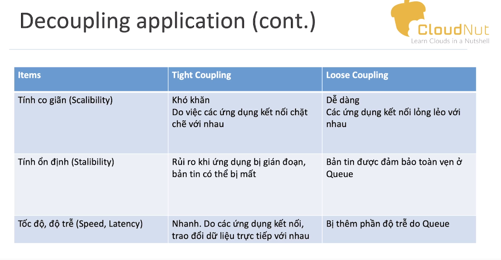

 * Chia ra làm 2 loại :
      - Tight coupling : cac service giao tiếp trực tiếp với nhau
      - Loose coupling :
           + Các service giao tiếp với nhau qua queue
           + 

     
 * SQS : Simple queue service  
     - aws managed queue service : không cần quan tầm đến hạ tầng máy ảo bên dưới mà chỉ cần tạo ra queue để sử dụng 
  
      - SQS Standard queue :
          +  Không bị giới hạn về băng thông (Unlimited Throughout) và số lượng Message trong queue
          + Mặc định thời gian lưu trữ trong queue là 4 ngày có thể up lên 14 ngay
          + Kich thươc message tối đa là 256kb size
          + Độ trễ thấp (< 10ms cho viec gửi và nhận message)
          + Bản tin được gửi it nhat 1 làn 
      
      - SQS - FIFO Queue
          + Giong voi standard queue