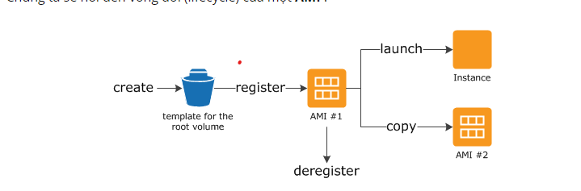

 * AMI : Amazon machine image 
      - Concept : 
           + là 1 loại đặc biệt của chương trình virtual appliance được sử dụng để khởi tạo hệ điều hành máy chủ ảo đám mấy Ec2 instance
           + VA là sự tích hợp của hệ điều hành vaf các ứng dụng ( đã được cài đặt và cấu hình sẵn trên HDH đó ) 
                note : AMI giống như cách bạn muốn tạo ra 1 bản sao của 1 instance đã được tạo với setting cấu hình giống như nhau
           + Characteristic ( đặc điểm ):
                + Template cho root volumn : của máy chủ ảo instance ví dụ như hệ điều hành (OS) , application server hay những application cần thiết 
                + Launch permisstions : quyền kiểm soát tài khoản aws nào được phép sử dụng AMI để khởi tạo máy chủ ảo Instance
                + Block divice mapping : chỉ định volumns nào sẽ được mapping với instance khi instance khởi tạo
           + AMI Lifecycle :
               