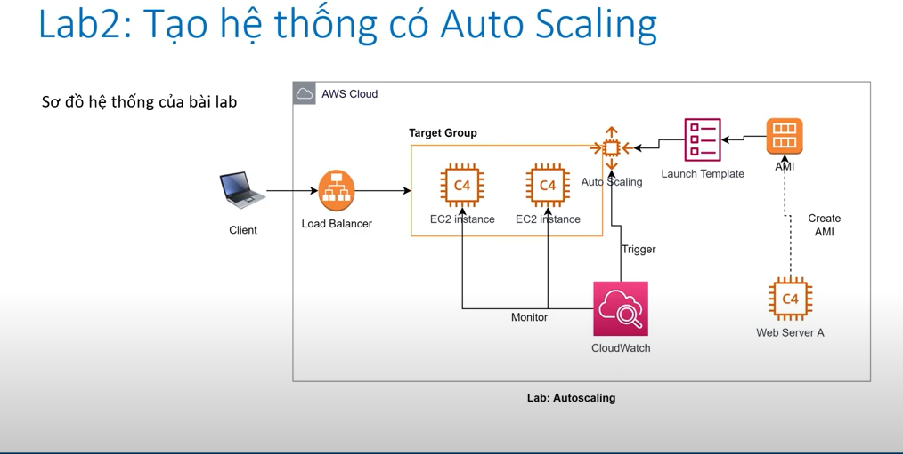

   * Concept :
         khi một sự cố xảy ra ở một thành phần nào đó có thể dẫn đến hệ thống bị dừng hoạt động , không thể phục vụ
         người dùng , ta gọi đó là single point of failure
   * Ex:
         + Một chương trình bị lỗivafaf crash
         + Database bị sập và k thể response
         + Hệ điều hành OS bị treo
         + Một trong các thành phần cứng vật lý (RAM , CPU , DISK , Power) bị hỏng 
   * Why must use :
         + Nếu hệ thông có nhiều hơn 1 thành phần cần cps 1 cơ chế để phân phối request từ client đến các thành phần ở backend => su ra đời của load balancer
         + AWS cho phép dễ dàng setup load balance tới nhiều target nằm ở các availability zone khasc nhau
   * Elastic load balancing :
         + Môt dịch vụ của AWS có nhiệm vụ điều hướng request từ client đến các target backend , đảm bảo request được cân bằng giữa các target 
         + ELB là 1 dịch vụ managed hoàn toàn bởi aws , dễ dàng setup , cos đầy đủ các đặc tính cần thiết nh :
               + High availability
               + Scalability : gần như không giới hạn
               + High security : nếu kết hợp với các dịch vụ khác như WAF , Security group
               + ELB có thể sẵn sàng kết hợp đa dạng backend sử dụng EC2 , Lambda , Container 
   * Ingredient load balancer :
         + Load balancer cho phép setting các listener (trên 1 port nào đó vd :80, HTTPS :443)
         + Mỗi listener cho phép cấu hình từng rule
         + Request sau khi đi vào listener , được đánh giá bởi các rule sẽ đc forward tới target group phù hợp
         + Target group có nhiệm vụ health check để phát hiện và loại bỏ target un-healthy
   * 
         - Mục đích sử dụng : ví dụ như 1 con server trong target group bị chết load balancer  sẽ điều hướng sang 1 server khác còn healthy
                              tạo nhiều target-group vs mục đích tạo nhiều listener với nhiều port khác nhau để lắng nghe từ load balancer

   * Auto scaling :
          
   * Step creat auto scaling :
        
       + auto group scaling sẽ start 1 new instance Ec2 khi có số instance trong group bị dừng hoặc tắt đột ngột và số instance hoạt động nhỏ hơn instance minxilum đã setting