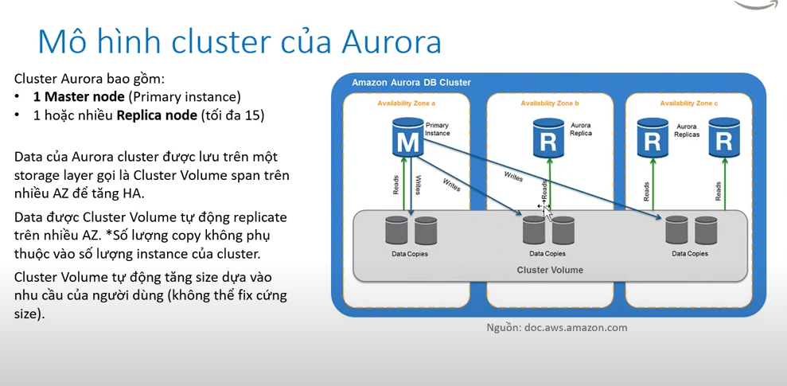
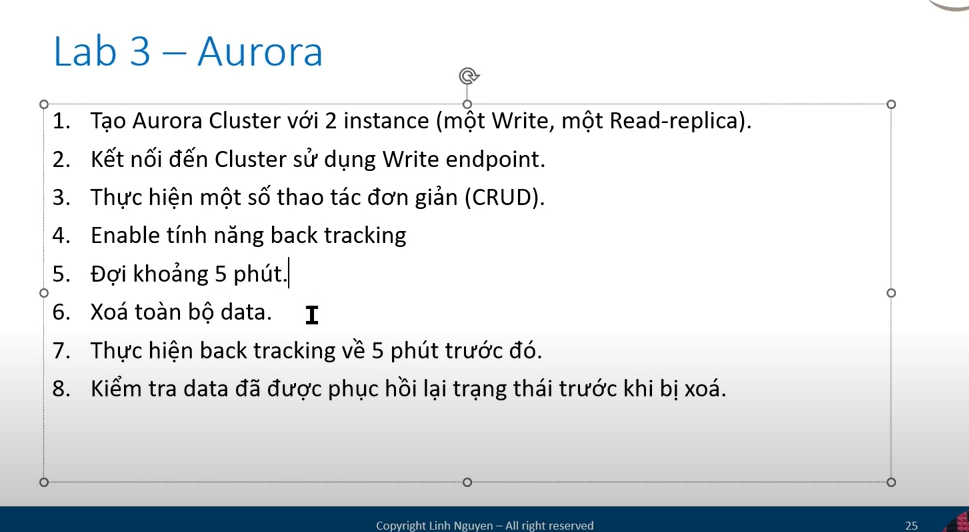
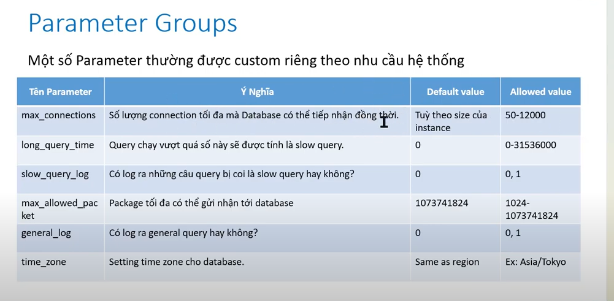

* Là công nghệ database độc quyền của AWS , hỗ trợ 2 loại engine là Mysql và PostgresSQL :
          - Aurora có 2 hình thức triển khai :
                + Cluster ( Master + Multi read replica )
                + Serverless
* Những tính năng vượt trội của Aurora so với RDS thông thường :
          - Hiệu năng tốt hơn ( so với RDS instance cùng cấu hình )
          - Hỗ trợ backtracking ( cho phép database về trạng thái trong quá khứ tối đa 72h ). Khác với restore từ snapshot
            đòi hỏi tạo instance mới , backtracking restore ngay trên cluster đang chạy 
          - Tự động quản lý write endpoint , read endpoint ở cấp độ cluster 
* Mô hình aurora :
          
* Lab :
* 

* Setting parameter group :
       