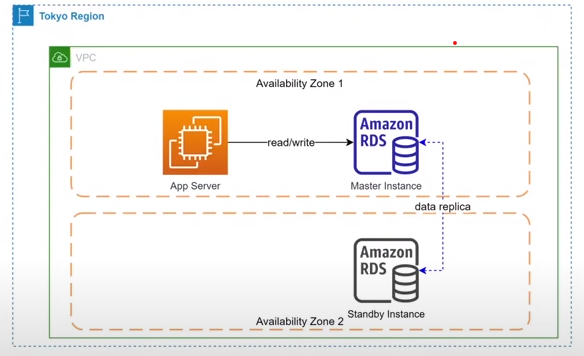
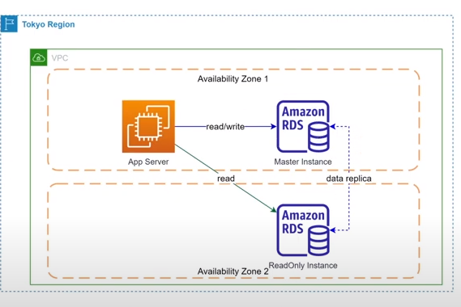
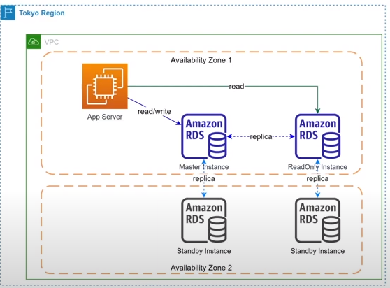
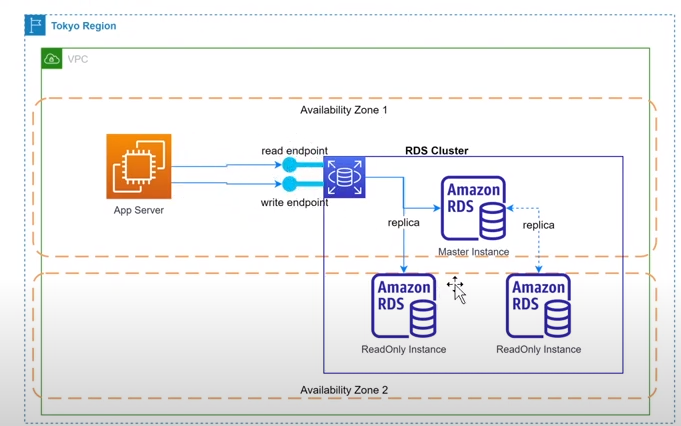
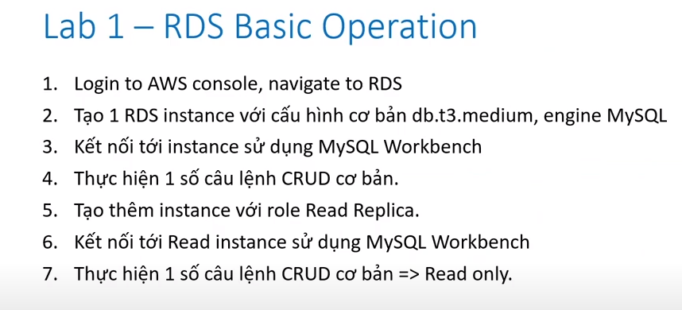
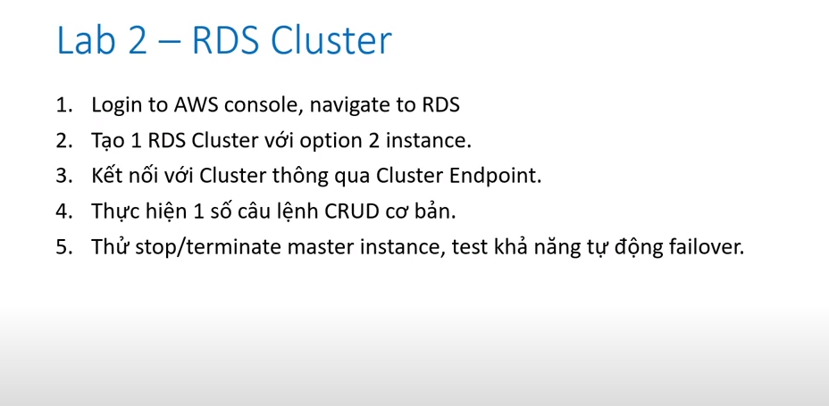

   * Mô hình triển khai RDS :
           - RDS có the đc triển khai theo một số mô hình sau : 
                + Single instance
                + Single instance with multi - AZ option = yes 
                + Master - Read only cluster 
                + Master - Read only cluster with multi - az option = yes
                + Master - Multi read cluster
    
   * Single instance :
          - Chỉ có 1 database instance duy nhất được tạo ra trên 1 Avaibility Zone
          - Nếu sự cố xảy ra ở cấp độ AZ database không thể truy cập 
          - Phu hoợp cho mtr dev test để tiết kiệm chi phí 
   * Single instance with multi AZ option enable :
          - Một bản sao của insatnce sẽ được tạo ra ở AZ khác v hoạt động dưới mode standby
          - Nhiệm vụ của instance standby này là sync data từ master , không thể truy cập instance này 
          *  
   * Master - Read Only cluster :
          - Một instance với mode read only sẽ đươc tạo ra và liên tục replica data từ master instance 
          - Instance này chỉ có th đọc data phù hợp cho hệ thống cos workload read > write , muốn tôi ưu performance cho database;
          - Sau khi thiết lập quan hệ , instance se đươc tạo ra kết hợp thành 1 cluster;
           ( Instance read-only không nhất thiết phả khác AZ với Master )
           * 
   * Master - Read only cluster with multi - AZ option = yes 
          - Tương tự moo hình master - read only tuy nhiên các node đều được bật multi-AZ enabled 
          - Chi phí đắt gấp 4 lần 
          - 

   * Nên tạo RDS cluster hay RDS Instance :
          - AWS cung cấp cơ chế cho phép tạo ra 1 cluster RDS giúp quản lycs các node và failover dễ dàng hơn 
          - Uư điểm so với RDS thông thường :
                + Quản lý endpoint ở cấp độ cluster , không bị thay đổi khi instance trong cluster gặp sự cố 
                + failover tự động
                + Scale read instance dễ dàng
   * Mô hình cluster :
        

  => Thực hành single instance and read instance read replica: 
      2 database 2 là 2 endpoint khác nhau , => nếu instance primary bị stop , instance replica sẽ thay thế nhưng application bên dưới cần phải config lại endpoint để connect => đây là nhược điểm
  => Thực hành RDS cluster :
  
  * Option : 
    Multi-AZ DB Cluster - new
        Creates a DB cluster with a primary DB instance and two readable standby DB instances, 
        with each DB instance in a different Availability Zone (AZ). Provides high availability, data redundancy and increases capacity to serve read workloads.
    Multi-AZ DB instance
        Creates a primary DB instance and a standby DB instance in a different AZ. 
        Provides high availability and data redundancy, but the standby DB instance doesn't support connections for read workloads.
    Single DB instance
        Creates a single DB instance with no standby DB instances.
        
     