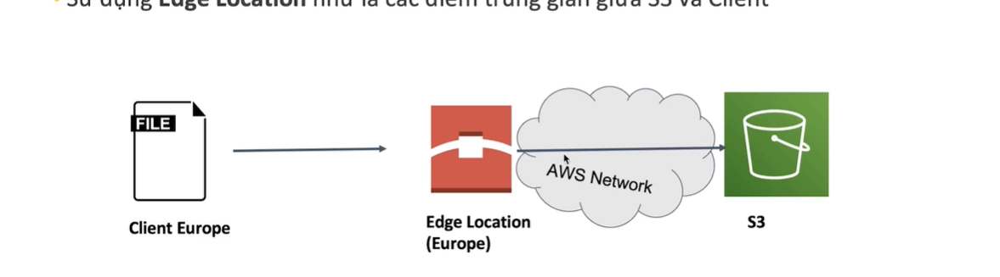

   S3 :
    - Viết tắt simple storage service
    - là dịch vụ quan trọng , ra đời lâu nhất của webservice
    - s3 lưu dưới dạng object 
    - lưu trữ không giới hạn , bởi vì là hệ lưu trữ phân tán -> dữ liệu phân tán ở khắp 
        nhiều nơi 
    - sử dụng để lưu trữ các file (text, image , media , video ,,,,)

 - khái niệm bucket :
     + tên của bucket là duy nhất ( không thể có 2 tên trùng nhau )
 
 - Object tương tư như các file :
     + key ( tên của object )
     + value (dữ liệu của object) :
         . kích thước của 1 object từ 1 đến 5TB
         . nếu kích thước file lớn chia nhỏ để upload
     + metadata :
         . dữ liệu mô tả về obect này ( được thiết lập tại thời điểm upload 
                object , sau đó không thể thay đổi )
          ex : thời gian upload object , storage class , dữ liệu có được
              mã hóa hay không   
     + version id :
          . tạo ra nh id version cho file khi upload trùng tên (vì s3 không thể sửa trực tiếp data)
          . giúp recover lại nh phiên bản cũ hơn của file 
 
 * S3 storage class : các kiểu lưu trữ trên s3 
   - S3 standard :
      + storage mặc định 
      + 99,99 % availibility (xác suất một yêu cầu lấy dữ liệu của object được trả về thành công)
      + 99,99 % xác xuất dữ liệu tồn tại được đảm bảo lưu tru trên s3
      + phù hợp các ứng dụng yêu cầu độ trễ thấp cho tác vụ lưu trữ file
      + các ứng dụng truy cập dữ liệu thường xuyên (Frequently access) vào s3
   - S3 standard IA : (Infrequently access)
      + dùng để lưu trữ dữ liệu it thường xuyên truy cập (khoảng 1 tháng 1 lần)
      + chi phí lưu trữ re hơn standard tier
      + bị mất thêm chi phí cho việc lấy object
      + objects có thể truy cập nhanh (real time)
      + object đảm bảo > 128k
   - S3 One - Zone IA (Infrequently access)
      + dùng để lưu dữ liệu ít thường xuyên truy cập 
      + dữ liệu của object được lưu trữ trong 1 AZ (Avalibility zone)
      + object đảm bảo > 128kb
      + dùng cho dữ liệu có thể khôi phuc được nếu một AZ BỊ sự cố
   - S3 Intelligent tier 
      + tự động di chuyển dữ liệu giữa các storate tier để tối ưu chi phí
      + dựa vào tần suất truy cập dữ liệu dể chọn storage tier phù hợp
      + phù hợp cho các kiểu dữ liệu có tần suất truy câp không đoán trước được'
   - S3 Glacier :
      + dùng để lưu tru dữ liệu lâu dài trên 3 - 10 năm 
      + chi phí rẻ 
      + lưu trữ tối thiểu trong 90 ngày 
      + thời gian lấy object trong vài giờ
   
   * S3 Security and Encrytion :
      - Identity-based policy : 
           + IAM policies sử dụng IAM polices để định nghĩa quyền cho các thực thể (IAM identities - user ,group, role ) được gắn policy này .
      - Resource based policy :
           + Buckets policies : sử dụng để định nghĩa ai có quyền truy cập Bucket này 
           + Access control lists : định nghĩa quyền truy cập cho các object
      - Networking :
           + Hỗ trợ VPC Endpoint cho các kết nối cần bảo mật riêng tư
      - Logging and audit :
           + Các lời gọi tới s3 được ghi lại bởi dịch vụ Cloudtrail
           + Các Logs liên quan tới truy cập S3 được lưu lại
      - User Security :
           + MFA Delete : Yêu cầu MFA cho hành động xóa Object , nhằm tránh việc không máy xóa Object
           + Pre-Signed URLs : Tạo URL cho viêc truy cập Object trong 1 thời gian giới hạn
      - Encrytion :
           + Mã hóa phia client : object được mã hóa trước khi được đẩy lên s3 

   * S3 lifecycle manager :
      - cấu hình chuyển storage class này -> storage khác -> nhằm giảm chi phí , phù hợp với nghiệp vu lưu trữ
   
   * S3 versioning :
      - lưu lại tất cả các version của 1 object 
      - object trên s3 chỉ có thể create , k thể update -> khi push object trùng name sẽ tạo ra 1 version mới đè lên version cũ 
       
   * S3 performance :
      - S3 baseline performance 
           + Mỗi perefix cho phép 3500 PUT/COPY/POST/DELETE và 5500 GET/HEAD request trong một Bucket
           + Không giới hạn số lượng prefix trong 1 Bucket 
           + VD về 1 prefix trong 1 Bucket s3 :
                . S3://bucket/folder/sub2/file2.txt
           + Càng nhiều prefix thì tốc độ hiệu năng đọc ghi dữ liệu của Bucket càng cao 
      - S3 Mutilpart upload :
           + Bắt buộc phải sử dụng cho object có dung lượng > 5GB
           + Giups tới ưu thông lượng nhờ việc upload song song 
      - S3 Transfer Acceseration 
           + Sử dụng cho việc upload object lên s3
           + Sử dụng Edge location như là các điểm trung gian giữa s3 va client
           + File từ client -> Edge location (độ trễ thấp) -> amazone dùng network riêng để push lên -> s3 -> tiết kiệm thời gian 
           + Edge location : như là 1 trang web mà CloudFront sử dụng để lưu các bản sao nội dung của bạ vào bộ nhớ đệm ẩn nhằm 
                             phân phối nhanh tới người dùng ở bất kì vị trí nào .
           + 
      - S3 Byte - Range Fetches :
           + Sử dụng Range HTTP header trong request để download một phần của byte range cyar object 
           + Tạo đồng thơ nhiều kết nối để download song song nhiều byet range của object
           + Giup tăng tốc độ download object
      
      * S3 CloudFront :
           + Content delivery networking (CDN)
           + Sử dụng để caching content
           + Giup tăng hệu năng ứng dụng
           + Content được lưu trữ tại Edge Location
           + Giarm nhẹ tấn công DDos 
      - Cách cloudFront hoạt động :
         Action : user truy cập file ở S3 
           + User -> cloudFront : 
                + Check xem ở data cache đã có tồn tại url hay chưa 
                      + if exist sẽ trả về cho client 
                      + if not exist sẽ access S3 -> luu giữ tại cache để phục vụ cho những lần access tiếp theo
      