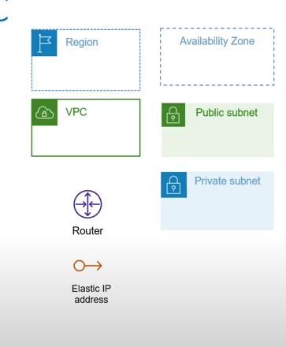
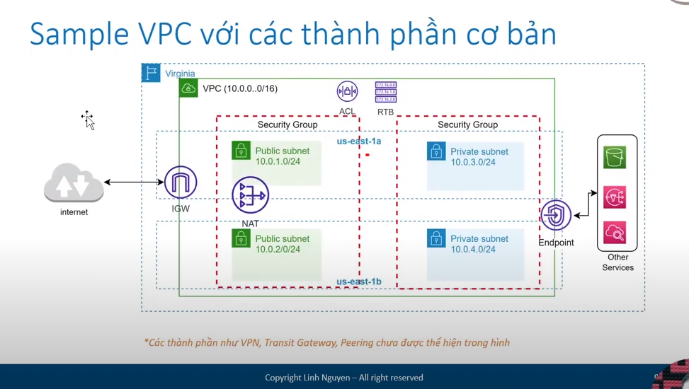
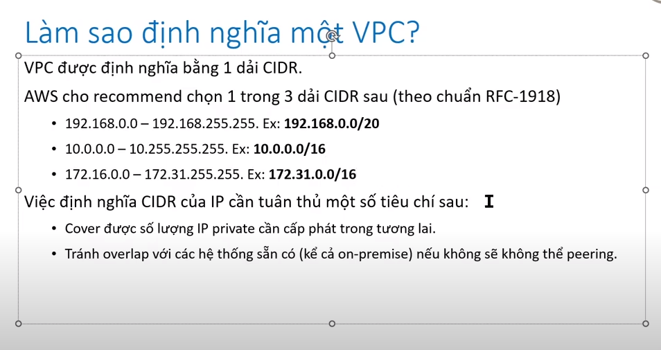
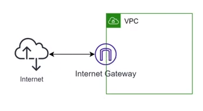
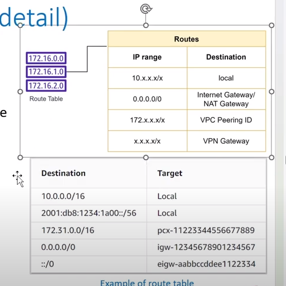
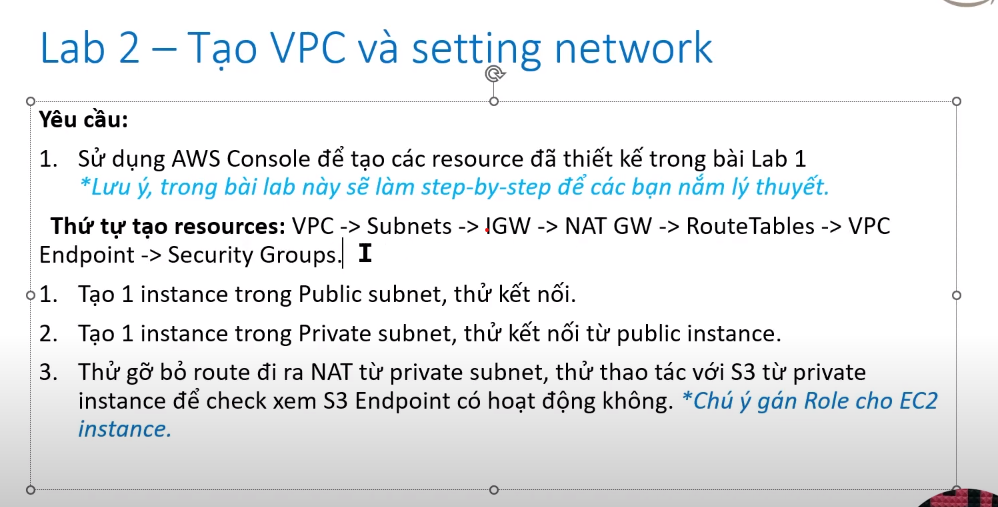

* Các thành phần cơ bản của VPC :
     - VPC : một mạng ảo được tạo ra ở cấp độ region 
     - Subnet : Một dải IP được định nghĩa nằm trong VPC . Mỗi subnet phải được quyêt định Zone tại thời điểm tạo
     - Ip address : IP v4 và v6 được cấp phát , có 2 loại Public Ip và private ip 
     - Routing : xác định traffic sẽ đc điều hướng đi đâu trong mạng 
     - 
    
     - Security group : 
           + Đong vai trò như 1 firewall ở câp độ instance , định nghĩa traffic được đi vào / đi ra 
           + Networking access control list ( ACL ) : được apply ở cấp độ subnet , tuơng tự như security group nhng có rule
             Deny và các rule được đánh giá độ ưu tiên . Mặc định khi tạo VPC sẽ có 1 ACL được apply cho toàn bộ subnet trong VPC
             ( mở all traffic không chặn gỉ cả  )
     - VPC flow log :
           + capture các thoong tin di chuyển cu traffic trong network 
           + VPN connection : kết nối VPC trên AWS với hệ thống dưới on-premise
           + Elastic Network interface : đong vai trò như 1 card mạng ảo 
     
     - Internet Gateway : kết nối vpc với internet , là cổng vào internet tới các thành phần trong VPC 
     - Nat gateway : dịch vụ Nat của AWS cho phép các thành phân bên trong kết nối tới internet nhưng không cho bên ngoài kết nối tới
     - VPC Endpoint : kênh kết nối private giúp kết nối tới các service khác của aws mà không qua internet
     - Peering connection : kênh kết nối giữa 2 VPC 
     - Transit gateways : đóng vai trò như 1 hub đứng giũa các VPCS , VPN connection , Direct Connect 
     - 
    
     - Định nghĩa CIDR :
            
     
     * Phân chia subnet :
           - Subnet được coi như 1 thành phần con của VPC 
           - Một VPC có thể chưa nhiều subnet không overlap nhau
           - Khi chọn 1 subnet phải chọn availability zone 
     * Chọn CIDR cho subnet cần lưu ý :
           - Số lượng Ip cho các resource cần cấp phát (Ec2 , Container , lambda ) 
             VD : bạn tạo 1 subnet 10.0.1.0/24 se chứa được 256 Ip trừ đi 5 service ip của AWS -> 251 ip khả dụng
           - Đặt số sao cho dễ quản lý 

     * Công thức tính số lượng ip :
           - một dải ip 10.0.0.0/22 có thể chứa tổng ộng 1024 ips => 2^(32 -22) = 1024
            => Số lượng subnet của 1 VPC = Tổng số IP / Số IP của mỗi subnet = 65536 / 1024 = 64 subnet
      
     * Các thành phần của VPC detail :
        * Internet gateway :
           - Là cửa ngõ để truy cập các thành phần trong VPC 
           - Nếu VPC không được gắn Internet Gateway thì không thể kết nối SSH tới instance kể cả instance kể cả instance đó có đc gắn public Ip 
           - Mặc định default-vpc do aws tạo sẵn đã có Internet gateway
            Image : 
        * Nat gateway :
           - Giup cho các instance trong private subnet có thể đi ra internet mà không cần tới public Ip 
           - Giup tăng cường bảo mật cho các resource cần private ( App, DB );
        
        * VPC endpoint :
            - Giusp cả resource trong VPC có thể kết nối tới các dịch vụ khác của AWS thông qua private connection 
            - Công dụng : secure , tăng tốc độ
            - Có 2 loại endpoint : Gateway endpoint ( S3, Dynamodb ) và interface endpoint ( SQS, Cloud watch )
              Endpoint có thể đc ấu hinh security group để hạn chế truy cập
        
        * Network access control list (acl) :
            - control network in/out đối với subnet được associate 
            - Mỗi rule se có các thông số :
                 + Priority 
                 + Allow / Deny 
                 + Protocol 
                 + port range 
                 + source ip / destination Ip 
            Default ACL sẽ allow all 
                 + sử dụng quá nhiều rule của ACL sẽ làm giảm performance
            
            Security group :
                 + Thường được gom nhóm các resource có chung network setting (in / out, protocol, port)
                 + Khi thiết kế cần quan tâm tới tính tái sử dụng 
                 + Source của một security group có thể là id của 1 security group khác 
                 + Rule của security group là statefull và không có deny rule
            
            Router table :
                + Định tuyến traffic trong subnet hoặc gateway sẽ được điều hướng đi đâu
                + Route table sẽ quyêt định 1 subnet sẽ là private hay public 
                + Một subnet chỉ c thê asociate 1 route table 
                + Default VPC do AWS tạo sẵn sẽ có 1 main route table associate với toàn bộ subnet
             
               
                + public route tabel cho phép đi ra internet gateway 
                + private route thì ngc lại 
       
        * Step create :
          
       