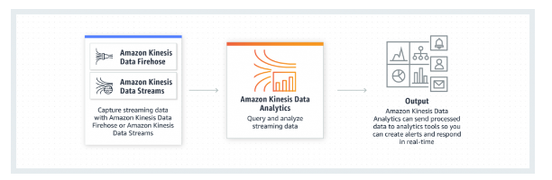
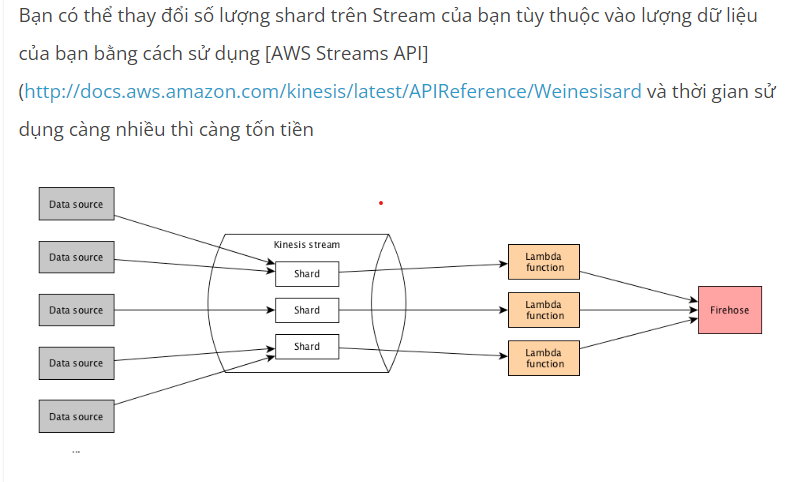

    Kinesis 
       Concept :
          + Amazon kinesis là service giúp bạn xây dựng được 1 ứng dụng có khả năng phân tích va xử lý luồng dữ liệu (stream data) theo thoi gian thực 
             co khả nang thu nhận luu trữ đến hng terabytes dữ liệu trong 1 giờ 
            ( Amazaon kinesis is service help you build a application have ability anaylis and handle stream data by realtime and have ability 
              acqurie and store up to terabytes of data in 1 hour)
          + Basically, Amazon kinesis provides you with a channel through which data can be easily and reliably (dang tin cay) 
              transimitted ( truyền đi ) to procesing application 
             ( Về cơ bản , kinesis cung cấp cho  bạn 1 kênh , nơi mà data sẽ được truyền đi 1 cách dễ dàng và đáng tin cậy đén nhũng hệ thông cầm sử lý )
          + Amazon can acquire data from hundered , thousand different record such as :
               - Click website 
               - Financial transaction ( giao dịch thương mại )
               - Social media 
               - IT log
          => data stream can handle by other service of amazone such as :  Amazon S3, Amazon Redshift, Amazon Elastic Map Reduce (Amazon EMR), AWS Lambda, AWS DynamoDB…
             
       
       Ingredient :
          + Producers : is which stream data to kinesis such as : web , app mobile, IOT 
          + Customer : is which revice data and handle it , customer are often application run in EC2
          + Shards :  are like a water pipe to transfer data from point a to b , per input shard can write 1MB/1s ( 1000 record / 1s ), output : 2MB/1s,
                      with big data need use a lot of shards
          
          + Data records : is a unit ( đơn vị ) in Amazone kinesis stream , data records have 3 part :
                     + Sequence number : is id of data record 
                     + Partition key : use to know data record belong to shards where in kinesis ( Unicode String 256 byte )
                     + Data blob : this is my data max 1MB , Data Blob can't change when or intervention (can thiệp) in any case ( trong bất kì trường hợp nào )

    * Strengths and weaknesses in kinesis (Điểm mạnh và điểm yếu của kinesis) :
          + Strengths : basic permission streaming data 
          + Weaknesses : money 

    * Compare Data strea, and data firehose :
          Characteristic (Đặc trưng)   |      Kinesis Data Stream               |    Kinesis Frieshose    
                                       |  Low latency , high scalability        |  use load data Amazone S3 , RedShift, Elastic Search và Splunk   
              Purpose ( Mục đích )     | ( độ trễ thấp , khả năng mo rộng cao ) |  (dich vụ tải dữ liệu vào Amazone S3 , Reds ...)      

              Allocation ability       |  Config Shard                          |   not manager 
              (Khả năng cấp phát)      |                                        |  
               
              Handle ability           |  Realtime with typical 200ms latency , |  Near realtime , belong to buffer size and buffer time ( min 60s )
    
              Open ability             |  Open by config shared                 | Auto scaling 

              Storage ability          |  1 - 7                                 | NOT Storage 

              
               